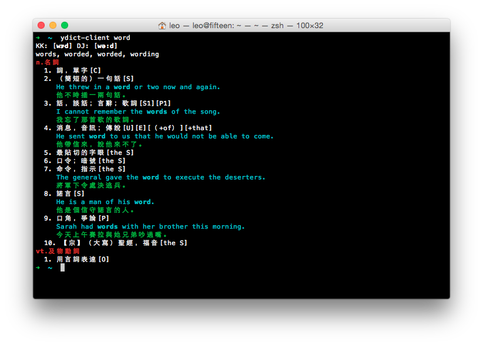

# ydict-client

A command-line interface to Yahoo's online English-Chinese dictionary.

## Installation

```bash
$ npm install -g ydict-client
```

## Usage

```bash
$ ydict-client <query string>
```

## Screenshot



## API

To use it programmatically:

```javascript
var ydict = require('ydict-client');

ydict('word', function(error, definition) {
  if (error) throw new Error(error);
  console.log(JSON.stringify(definition));
});
```

## Tests

```bash
$ npm install
$ npm test
```

## License

MIT
